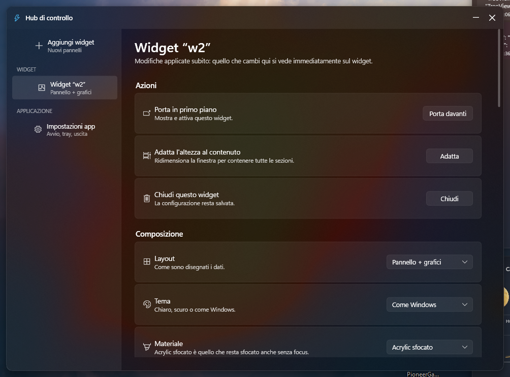
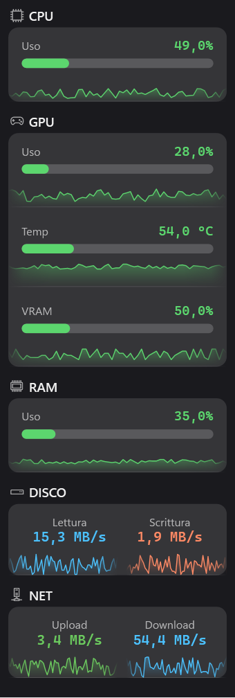
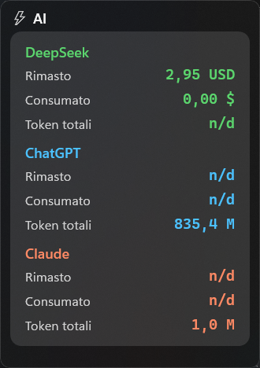
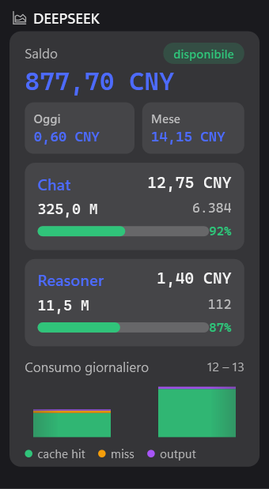

# HW Widget

Widget di monitoraggio per Windows 11 con materiale **acrilico/Mica**, grafici in tempo reale
e un hub di controllo in stile Impostazioni di Windows.





## Cosa mostra

| Elemento | Dati | Sorgente (nessun driver, nessun admin) |
|---|---|---|
| Rete | upload / download + grafici | `GetIfTable2` (IPv4+IPv6, sceglie l'adattatore attivo) |
| CPU | utilizzo % e frequenza | `GetSystemTimes` + WMI per il clock |
| GPU | utilizzo, VRAM, watt, temperatura | NVML (`nvml.dll` del driver NVIDIA) |
| RAM | utilizzo, frequenza | `GlobalMemoryStatusEx` + SMBIOS |
| Disco | lettura / scrittura | PDH con contatori in inglese |

## Caratteristiche

- **Layout**: righe compatte, card per elemento, tessere, pannello a barre e pannello con grafici.
- **Grafici**: stile area/linea/barre/scalini, durata 30 s → 10 min, aggiornamento 0,5/1/2 s.
  Arrivano ai bordi del box (a destra, a sinistra e in basso dove serve) e si spengono con
  una leggera sfumatura; il pieno sotto la linea sfuma verso il basso.
- **Materiale**: acrylic sfocato (sempre sfocato), Mica, Mica Alt, Acrylic DWM o pannello pieno.
- **Multi monitor**: posizione ricordata per monitor (device id + offset in pixel fisici).
- **Hub di controllo**: una pagina per widget con tutte le opzioni, applicate in tempo reale,
  più inserimento manuale di numeri e colori e riordino delle sezioni.
- **Tray**: doppio clic = hub, clic singolo = mostra/nascondi, tasto destro = menu.
- **Avvio con Windows**, icona dell'app e installer standalone.
- **Sezione AI** (solo numeri, senza grafici): budget rimasto, budget consumato e token
  totali per ogni fornitore attivo. Saldo DeepSeek dall'API, spesa OpenAI/Anthropic dalle
  API di fatturazione (chiavi salvate con DPAPI), token di ChatGPT/Claude dai log locali
  delle CLI, budget rimasto = budget mensile − speso (budget per widget, nell'hub).
  Spegnendo un fornitore le sue righe spariscono dal widget.

  

- **Widget DeepSeek** dedicato (preset "Solo DeepSeek"), con gli stessi dati del monitor di
  riferimento [Joyi-code/DeepSeekMonitorWindows](https://github.com/Joyi-code/DeepSeekMonitorWindows):
  saldo e disponibilità, costo di oggi e del mese, un riquadro per modello (token, richieste,
  cache hit, costo) e il grafico giornaliero a barre impilate (cache hit / miss / output).
  Saldo dall'API ufficiale; uso, spesa e cache hit dalle API interne di
  `platform.deepseek.com` (l'API ufficiale non li espone). Serve il token di sessione del
  sito: apri platform.deepseek.com, F12 → Console, `JSON.parse(localStorage.userToken).value`,
  poi incollalo in *Hub → Impostazioni app → Chiavi* (voce "Token di utilizzo DeepSeek").
  Il token scade: se i dati diventano `n/d`, ripetilo.

  

- **Aggiornamento automatico** dalle release GitHub: controlla, chiede, scarica e riavvia.
  `HWWidget.exe --update-silent` fa lo stesso giro senza interfaccia (per aggiornamenti
  pianificati e per verificare una release appena pubblicata).

## Struttura

```
Program.cs          AppController, tray icon, istanze multiple
MainWindow.xaml*    finestra widget (senza cornice, ridimensionamento a mano)
WidgetView.cs       i 5 layout e il binding dei dati
Sparkline.cs        grafici (ring buffer condiviso, 4 stili)
Sensors.cs          sampler: rete, CPU, RAM, disco, GPU (NVML), accent blur, PDH
WidgetConfig.cs     configurazione per widget + palette chiaro/scuro
ControlHub.cs       hub di controllo in stile impostazioni
HubTheme.cs         template WPF (pulsanti, switch, slider, combo, card)
Backdrop.cs         materiale finestra (accent blur / Mica / Acrylic)
SelfTest.cs         controlli eseguibili: HWWidget.exe --selftest
Setup/              installer standalone (progetto separato)
```

## Compilare

```powershell
dotnet build -c Release                     # app
dotnet run --project . -- --selftest        # controlli dei sensori e delle configurazioni
                                            # (include posizione/dimensioni e sezione AI)
dotnet publish -c Release -r win-x64 --self-contained false -p:PublishSingleFile=true -o dist
```

Installer standalone (include il runtime, nessun prerequisito sul PC di destinazione):

```powershell
dotnet publish -c Release -r win-x64 --self-contained true -p:PublishSingleFile=true `
  -p:IncludeNativeLibrariesForSelfExtract=true -p:EnableCompressionInSingleFile=true -o dist-sc
dotnet publish Setup/Setup.csproj -c Release -r win-x64 --self-contained true `
  -p:PublishSingleFile=true -p:IncludeNativeLibrariesForSelfExtract=true `
  -p:EnableCompressionInSingleFile=true -o installer
```

## Impostazioni

I file di configurazione stanno in `%APPDATA%\HWWidget\` (`settings.json` per il primo widget,
`settings-<id>.json` per gli altri) e si gestiscono da soli: valori fuori scala vengono corretti
al caricamento.
